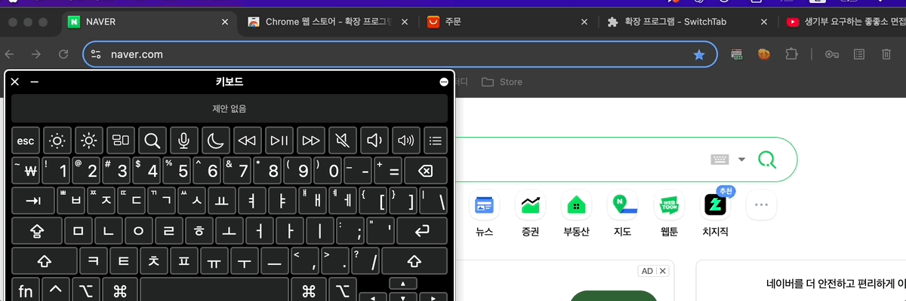

# SwitchTab

## Introduction

SwitchTab is a Chrome extension for macOS that helps you quickly switch between tabs in the Chrome browser. You can easily move between tabs using the ⌥ (Option) key and the arrow keys (→, ←).

> ⚠️ This extension has not been published on the Chrome Web Store yet.

## Installation

1. Clone this repository or download it as a ZIP file.
2. Go to `chrome://extensions` in your Chrome browser.
3. Enable **Developer mode** in the top right corner.
4. Click **Load unpacked** and select the folder you downloaded.
